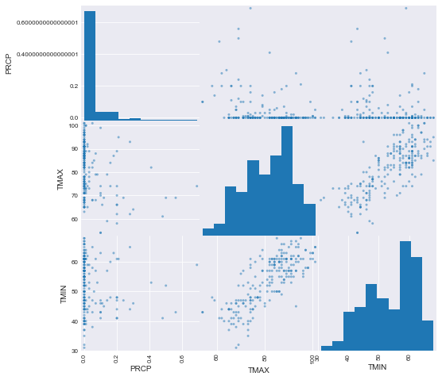
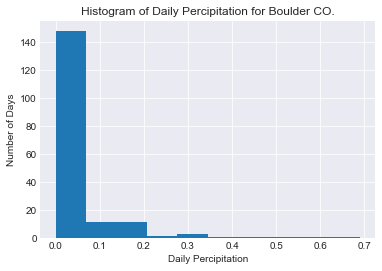
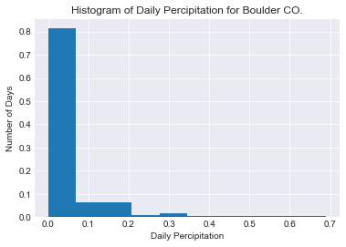
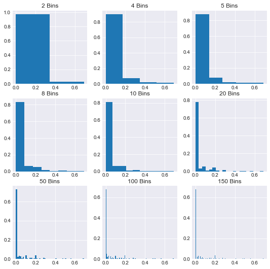
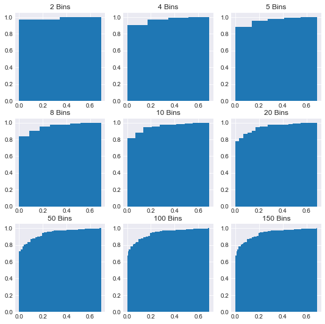

```python
import pandas as pd
import matplotlib.pyplot as plt
import seaborn as sns
%matplotlib inline
```


```python
df = pd.read_csv('boulder_weather.csv')
df.head()
```


<div>
<style scoped>
    .dataframe tbody tr th:only-of-type {
        vertical-align: middle;
    }

    .dataframe tbody tr th {
        vertical-align: top;
    }

    .dataframe thead th {
        text-align: right;
    }
</style>
<table border="1" class="dataframe">
  <thead>
    <tr style="text-align: right;">
      <th></th>
      <th>STATION</th>
      <th>NAME</th>
      <th>DATE</th>
      <th>PRCP</th>
      <th>TMAX</th>
      <th>TMIN</th>
    </tr>
  </thead>
  <tbody>
    <tr>
      <th>0</th>
      <td>USW00094075</td>
      <td>BOULDER 14 W, CO US</td>
      <td>2017-07-01</td>
      <td>0.00</td>
      <td>68.0</td>
      <td>31.0</td>
    </tr>
    <tr>
      <th>1</th>
      <td>USW00094075</td>
      <td>BOULDER 14 W, CO US</td>
      <td>2017-07-02</td>
      <td>0.00</td>
      <td>73.0</td>
      <td>35.0</td>
    </tr>
    <tr>
      <th>2</th>
      <td>USW00094075</td>
      <td>BOULDER 14 W, CO US</td>
      <td>2017-07-03</td>
      <td>0.00</td>
      <td>68.0</td>
      <td>46.0</td>
    </tr>
    <tr>
      <th>3</th>
      <td>USW00094075</td>
      <td>BOULDER 14 W, CO US</td>
      <td>2017-07-04</td>
      <td>0.05</td>
      <td>68.0</td>
      <td>43.0</td>
    </tr>
    <tr>
      <th>4</th>
      <td>USW00094075</td>
      <td>BOULDER 14 W, CO US</td>
      <td>2017-07-05</td>
      <td>0.01</td>
      <td>73.0</td>
      <td>40.0</td>
    </tr>
  </tbody>
</table>
</div>


## Histograms
Recall that we can begin exploring our data from a statistical point of view by visually inspecting a histogram of our variables. To do this for all variables all at once, we can use the pd.plotting.scatter_matrix(df) (diagonal entries are histogram distributions of that variable, off cells are correlation plots of two variables against each other).


```python
# Seaborn makes everything so pretty! Check out details here:
# This is optional but makes a nice design for all of our proceeding graphs
sns.set_style('darkgrid')
```


```python
pd.plotting.scatter_matrix(df, figsize=(8,8))
```


    array([[<matplotlib.axes._subplots.AxesSubplot object at 0x1a1a134358>,
            <matplotlib.axes._subplots.AxesSubplot object at 0x1a1a159710>,
            <matplotlib.axes._subplots.AxesSubplot object at 0x1a1a1e61d0>],
           [<matplotlib.axes._subplots.AxesSubplot object at 0x1a1a20ac50>,
            <matplotlib.axes._subplots.AxesSubplot object at 0x1a1a238710>,
            <matplotlib.axes._subplots.AxesSubplot object at 0x1a1a238748>],
           [<matplotlib.axes._subplots.AxesSubplot object at 0x1a1a28bc50>,
            <matplotlib.axes._subplots.AxesSubplot object at 0x1a1a2bb710>,
            <matplotlib.axes._subplots.AxesSubplot object at 0x1a1a2eb1d0>]],
          dtype=object)





 Alternatively or to inspect the distributon of a single variable we can use pandas built in .hist() method:


```python
df.PRCP.hist()
plt.title('Histogram of Daily Percipitation for Boulder CO.')
plt.xlabel('Daily Percipitation')
plt.ylabel('Number of Days')
```


    Text(0,0.5,'Number of Days')





## Probability Mass Functions (PMFs)
Probability mass functions are essentially normalized histograms. They show the probability (or normalized frequency) of each event occuring.

Doing this with pandas built in histogram method is sadly slightly verbose.  
To do so we have to create weights so that each occurence is counted as 1/number observations rather then 1.


```python
num_obs = len(df[~df.PRCP.isnull()]) #Count the number of non null values
w = [1/num_obs for i in range(num_obs)] #Create an array of weights
df.PRCP.hist(weights = w)
plt.title('Histogram of Daily Percipitation for Boulder CO.')
plt.xlabel('Daily Percipitation')
plt.ylabel('Number of Days')
```


    Text(0,0.5,'Number of Days')





#### You should also note how different these graphs begin to look if we drastically alter the number of bins:


```python
fig, axes = plt.subplots(nrows=3, ncols=3, figsize=(9,9))
bins_options = [2,4,5,8,10,20,50,100,150]
for n in range(9):
    i, j = n//3, n%3
    df.PRCP.hist(ax=axes[i,j], bins=bins_options[n], weights=w)
    ax=axes[i,j]
    ax.set_title('{} Bins'.format(bins_options[n]))
```





## Cumulative Distribution Functions CDFs
Due to this problem with binning, it's also often helpful to visualize everything as a cumulative distribution; the further and further to the right you go the closer to having viewed all possible outcomes/observations. This is only a minor change to our previous code; set the optional paramater **cumulative** to True:


```python
fig, axes = plt.subplots(nrows=3, ncols=3, figsize=(9,9))
bins_options = [2,4,5,8,10,20,50,100,150]
for n in range(9):
    i, j = n//3, n%3
    df.PRCP.hist(ax=axes[i,j], bins=bins_options[n], weights=w, cumulative=True)
    ax=axes[i,j]
    ax.set_title('{} Bins'.format(bins_options[n]))
```





So far we've viewed empirical distributions of observations. Ultimately, our goal is to model these variables so we'll now turn to some analytical or theoretical distributions and compare their properties. In the end, this will provide us further tools to analyze datasets.

# Exercises
* Create two different histograms, one depicting rainfall in the first week of July, and a second depicting rainfall the last week of July. Which week was rainier?
